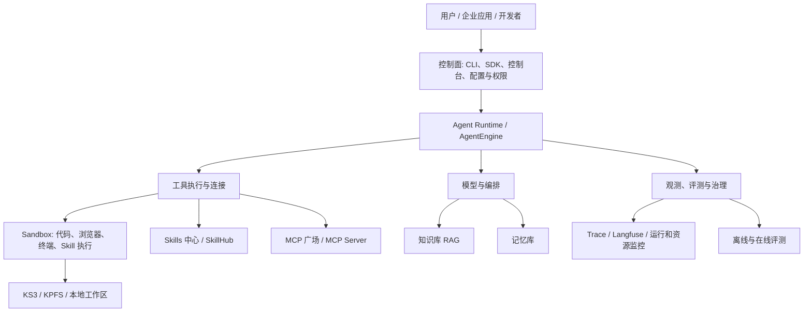

# 星源 AgentKit 总体架构与关系图

## 分层视图

## 关键关系

| 上游 | 下游 | 关系与边界 |
| --- | --- | --- |
| 控制面 | Agent Runtime | 创建、配置、部署和管理运行单元；不直接承载用户任务执行。 |
| Agent Runtime | Sandbox | Runtime 选择何时执行，Sandbox 负责在受限环境中实际执行代码、终端、浏览器或 Skill。 |
| Skills 中心 | Sandbox / Agent | Skills 中心分发 Skill 元数据与 ZIP 内容；Agent 按需下载，执行可发生于远程 Skills Sandbox 或本地资源。 |
| MCP | Agent Runtime | MCP 让 Runtime 中的 Agent 以标准协议发现并调用外部能力；MCP 本身不替代执行隔离。 |
| 知识库、记忆库 | 模型与 Agent | 为推理提供可检索的企业事实与长期上下文；它们不负责工具执行。 |
| 可观测与评测 | 全链路 | 记录运行、工具调用、资源、结果质量与成本，为治理和迭代提供闭环。 |

## 端到端任务链路

1. 开发者通过 CLI/SDK 或控制台创建并部署 Agent，配置模型、工具、权限、存储和观测。
2. 用户请求进入 Agent Runtime；Runtime 负责编排模型、记忆和知识检索，决定是否调用工具。
3. 当需要企业系统能力时，Runtime 经 MCP 调用服务；当需要执行代码、浏览网页、处理文件或运行 Skill 时，Runtime 请求 Sandbox。
4. Sandbox 在实例边界内挂载授权的 Skill/工作区/对象存储，运行后仅把受控结果、日志和产物回传。
5. 运行的 Trace、资源数据、异常和评测样本进入可观测与评测链路，反向改进 Prompt、工具、模型、Skill 和资源配置。

## 设计原则

- **编排与执行分离**：Runtime 决策，Sandbox 执行。
- **连接与执行分离**：MCP 提供外部系统连接，Sandbox 负责本地危险动作的隔离。
- **知识与状态分离**：知识库服务事实检索，记忆库服务用户/任务连续性。
- **控制面与数据面分离**：控制台与 CLI 负责配置治理，任务数据面追求可扩展、可观测和可恢复。
