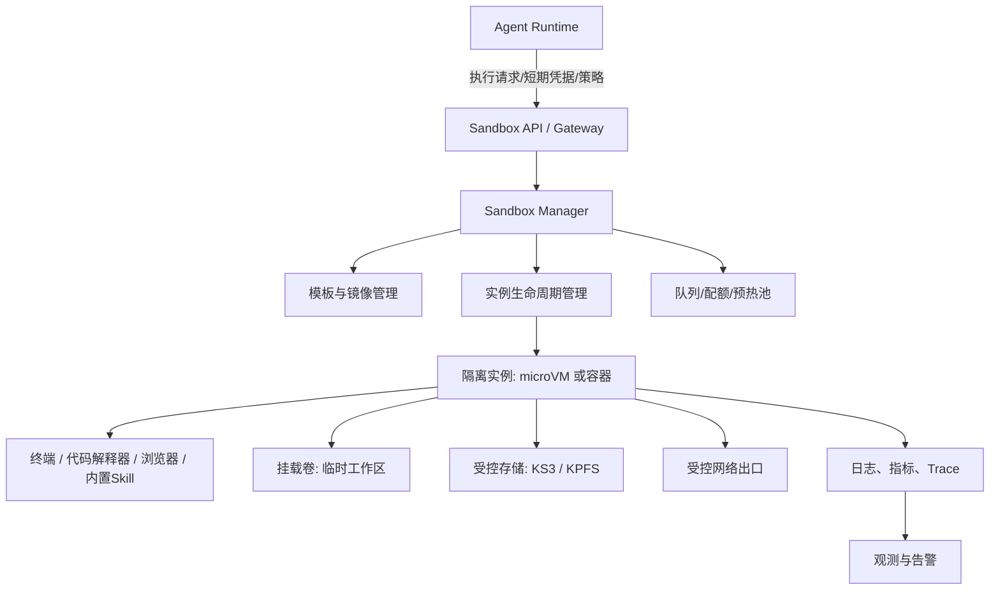
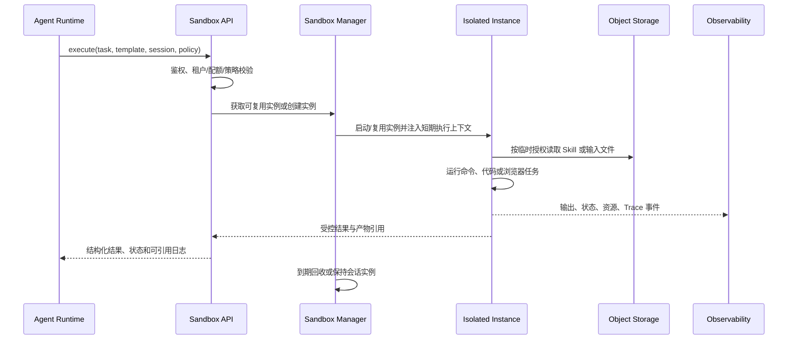

# 沙箱 Sandbox 专题

## 0. 结论与定位

Sandbox 是星源 AgentKit 的**受控执行层**：当 Agent 需要运行代码、执行终端命令、操作文件、使用浏览器自动化或运行 Skill 脚本时，Sandbox 用独立实例把这些高风险动作与 Agent Runtime、控制面和企业主环境隔开。

> 来源事实：路线图明确列出标准模板、Skill 执行、预热、实例管理、终端命令、代码运行、浏览器操作、KS3/KPFS 挂载、日志和监控。<br>
> 分析判断：Sandbox 是平台高合规差异化与 Agent Infra 的关键执行子系统，而非普通“代码运行工具”。

## 1. 要解决的风险

| 风险 | 典型触发动作 | Sandbox 的控制目标 |
| --- | --- | --- |
| 任意代码风险 | Agent 生成 Python/Node/Shell、安装依赖、执行分析脚本 | 让进程、文件、网络和资源限制落在独立实例中 |
| 浏览器外溢 | 登录后台、抓取网页、下载文件、自动填表 | 将浏览器会话、下载目录和可能的恶意页面困在执行边界内 |
| 文件与数据泄露 | 处理企业报表、读取挂载文件、生成结果 | 仅挂载任务授权的目录/对象，限制回传范围并保留审计 |
| Skill 供应链风险 | 运行内置或自建 Skill 中的脚本 | 对 Skill 包来源、版本、权限和执行结果建立可追踪闭环 |
| 资源失控 | 无限循环、大量下载、内存爆炸、僵尸进程 | 配额、超时、并发、生命周期回收和资源监控 |
| 多租户串扰 | 多客户/多 Agent 共用平台资源 | 实例、身份、存储前缀、日志和网络策略均按租户/任务隔离 |

## 2. 逻辑架构



### 2.1 控制面、数据面和管理面

- **控制面**：Runtime、控制台或 CLI 发起实例创建、模板选择、资源配额和权限配置；不应把高权限凭据直接下发到执行容器。
- **Sandbox Manager**：管理模板、实例状态、预热与回收；它是策略落地和资源编排的关键入口。
- **执行数据面**：每个实例负责实际代码/命令/浏览器/Skill 运行，应该使用临时工作目录和显式允许的存储挂载。
- **观测面**：采集实例状态、命令/任务事件、资源消耗、输出摘要和失败原因，关联到 Agent Trace 与租户/会话。

## 3. 核心对象与生命周期

| 对象 | 责任 | 关键字段/状态（建议） |
| --- | --- | --- |
| Sandbox Template | 标准运行镜像和预置运行时 | 模板 ID、版本、运行时、预装工具、默认资源、网络策略、批准状态 |
| Sandbox Instance | 一次或一段会话的隔离执行环境 | 实例 ID、租户、Agent、Session、模板、状态、过期时间、资源用量 |
| Execution | 在实例内一次命令/代码/浏览器/Skill 调用 | 执行 ID、输入、超时、退出码、输出引用、Trace ID |
| Mount Grant | 对对象存储、文件系统或 Skill 包的临时授权 | 资源 URI、读写权限、作用域、过期时间、审计 ID |
| Image Warm Pool | 预先拉起或预热的实例池 | 模板、地域、最小/最大容量、命中率、回收策略 |

**推荐生命周期**：`requested → scheduled → provisioning → ready → executing ↔ ready → draining → terminated`。出现策略拒绝、镜像失败、资源不足、超时或运行失败时，进入明确的失败终态并保留诊断事件。

## 4. 端到端执行流程

### 4.1 一次安全执行



### 4.2 关键控制点

1. **调用前**：校验 Agent 身份、租户、模板准入、任务类型、资源配额和网络策略。
2. **实例创建时**：只注入最小权限的短期身份；拒绝把云主密钥、长期 Token 写入镜像或命令行。
3. **挂载时**：按路径、对象前缀和只读/读写权限细分；默认临时盘、默认不持久化。
4. **运行中**：限制 CPU、内存、进程数、磁盘、超时、并发与网络目的地；实时采集异常和资源峰值。
5. **结果回传时**：只允许白名单类型/大小的产物；将大文件转为对象存储引用，而非直接塞进模型上下文。
6. **回收时**：终止进程、卸载挂载、清理临时盘、撤销短期凭据；保留必要审计元数据而非原始敏感内容。

## 5. Skill 与 Sandbox 的关系

来源截图显示，Skills 可有“Skills 沙箱”与“无 Skills 沙箱”两种执行路径；AgentKit 会通过工具 ID/元数据决定注册和执行方式。

| 模式 | Skill 元数据与包 | 执行位置 | 适用场景 | 风险关注 |
| --- | --- | --- | --- |
| 有 Skills Sandbox | 通过 Skills 空间 API 获取，按需下载 ZIP | 远程 Skills Sandbox | 需要强隔离、统一托管的 Skill | 包签名、下载路径、执行身份、网络与挂载 |
| 无 Skills Sandbox | 同样可从 Skills 空间获取并缓存 | Agent 本地资源 | 低风险、开发调试或受控环境 | 本机权限、缓存污染、宿主机隔离不足 |

### 5.1 按需下载与缓存

1. 会话启动，Agent 通过 `ListSkillsBySpaceId` 获取 Skill 名称、描述、内容哈希和对象存储路径等元数据。
2. 将名称和描述注入系统提示词，供模型判断可用能力；不必把完整 Skill 内容全部放进上下文。
3. 模型选择 Skill 后，检查本地/实例缓存是否已有同一版本。
4. 未命中时，按照元数据中的对象存储路径下载 ZIP，解压到隔离工作区，读取 `SKILL.md` 并执行明确允许的脚本。
5. 使用内容哈希判断是否更新：一致则复用缓存，不一致则使旧缓存失效并重新拉取。

### 5.2 Skill 包建议结构

```text
my-skill/
├── SKILL.md        # 必须：元数据与执行说明
├── scripts/        # 可执行脚本
├── references/     # 参考资料
└── assets/         # 模板、静态资源
```

**治理要求（分析建议）**：Skill 的包版本、内容哈希、发布者、审批状态、所需权限、网络需求、运行模板、依赖锁定文件必须可查；高风险 Skill 必须只允许在 Sandbox 中运行。

## 6. 存储、网络和身份边界

### 存储

- 路线图提出挂载 KS3、KPFS。建议将它们视为“按任务授权的外部数据源”，而不是默认可见的共享磁盘。
- 输入、临时文件、输出、审计日志应分开存放，分别定义保留期和加密策略。
- 对象存储路径至少应包含租户/项目/任务维度，禁止跨租户通配符授权。

### 网络

- 默认拒绝出网；按模板或任务启用域名/IP 白名单、DNS/代理策略和端口限制。
- 将浏览器访问与普通代码出网纳入同一出口审计，但保留不同的策略标签。
- MCP 请求虽然可能由 Runtime 发起，若 Sandbox 内也需访问 MCP/内网服务，同样应通过受控身份和服务网关，不能把内网全量暴露给实例。

### 身份与凭据

- 使用短期、最小作用域凭据；凭据由控制面或可信代理注入并在实例回收后失效。
- 日志不得打印授权头、Token、Secret、连接串或完整敏感输入。
- 人工调试需要受审计的临时授权、审批和自动到期；不能复用生产 Agent 身份。

## 7. 资源、预热与成本

| 机制 | 解决的问题 | 指标 |
| --- | --- | --- |
| 标准模板 | 运行环境一致、减少安装成本 | 模板版本覆盖率、漏洞修复时延 |
| 预热池 | 降低首次执行冷启动 | P50/P95 启动时延、池命中率、空闲成本 |
| 会话复用 | 多步任务保持上下文、减少反复启动 | 复用率、泄露/残留检测、会话回收率 |
| 配额和并发控制 | 避免单租户或异常任务挤占资源 | 拒绝率、排队时长、资源使用率 |
| 自动回收 | 控制僵尸实例和存储成本 | 超时回收成功率、遗留挂载数 |

资源计费需与 Agent Runtime 账单关联。截图材料显示 Serverless 资源调度/账单是 AgentEngine 方向的一部分；实施时应把 Sandbox 的实例时长、规格、存储、网络和预热成本映射到同一 Trace/任务 ID，支持按租户、Agent、Skill 和模板归因。

## 8. 可观测、审计与告警

### 应记录的最小事件

| 事件 | 最小字段 |
| --- | --- |
| 实例创建/回收 | 实例、模板、租户、Agent、会话、时间、原因、状态 |
| 执行开始/结束 | 执行 ID、任务类型、超时、退出码、耗时、结果大小 |
| 权限与挂载 | 请求身份、资源 URI、权限、策略命中、拒绝原因 |
| 网络访问 | 目的地类别、策略结果、字节数、拒绝原因；敏感载荷不入日志 |
| 资源指标 | CPU、内存、磁盘、进程、网络、排队、冷启动 |
| 安全异常 | 非法命令、越权访问、恶意下载、密钥泄露检测、异常外联 |

### 告警优先级

1. 实例逃逸/越权、跨租户访问、敏感凭据外泄：立即阻断、保留证据、升级安全响应。
2. 异常出网、异常资源占用、连续超时：限流/隔离并通知值班。
3. 预热池耗尽、模板拉取失败、挂载故障：影响可用性，触发容量或发布回滚流程。

## 9. 最小 API 契约（建议）

以下为便于产品和工程对齐的逻辑契约，**不是已确认的官方接口**。

```json
POST /sandbox-executions
{
  "agent_id": "agent_x",
  "session_id": "session_y",
  "template_id": "browser-python-v1",
  "execution_type": "skill|command|code|browser",
  "input": {"skill_name": "analyze-data", "arguments": {}},
  "limits": {"timeout_seconds": 120, "cpu": 1, "memory_mb": 2048},
  "mounts": [{"uri": "ks3://bucket/project/input/", "mode": "read"}],
  "trace_id": "trace_z"
}
```

响应应至少包含：`execution_id`、`instance_id`、状态、可安全展示的标准输出摘要、退出码、产物引用、日志/Trace 引用和策略拒绝原因。

## 10. 验收清单

- [ ] 可以从批准模板创建和回收实例，失败有可诊断状态。
- [ ] 代码、终端、浏览器和内置/挂载 Skill 运行均受超时、资源和权限控制。
- [ ] 未授权的存储、网络和跨租户访问被拒绝且产生审计记录。
- [ ] KS3/KPFS 挂载按任务短期授权，实例回收后不可继续访问。
- [ ] 同一 Skill 包内容哈希变化后能触发缓存失效和重新下载。
- [ ] 冷启动、预热命中、排队、执行耗时、资源、失败原因能关联 Agent Trace。
- [ ] 支持从 Agent、租户、模板、Skill 四个维度归集成本与错误率。
- [ ] 人工调试、日志查看和产物下载经过权限控制与审计。

## 11. 与其他模块的职责边界

| 模块 | Sandbox 负责 | 该模块负责 |
| --- | --- | --- |
| Agent Runtime | 安全执行环境与执行结果 | 任务编排、部署、会话与资源调度 |
| MCP | 需要在实例内执行的本地动作可被隔离 | 外部工具标准化发现、调用和鉴权 |
| Skills | 执行 Skill 脚本、隔离依赖与文件 | Skill 创建、空间、元数据、授权、版本分发 |
| 知识库/记忆库 | 可在实例中处理其返回的数据 | 检索、切片、召回、记忆策略与持久化 |
| 可观测/评测 | 上报执行日志和资源数据 | 汇聚 Trace、质量/成本分析和实验评估 |
